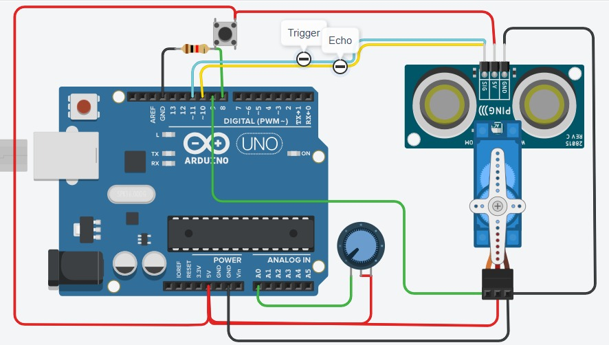

# Proyecto Arduino + Processing 🚀

## Descripción
Este proyecto utiliza un **Arduino Uno** conectado a un **sensor ultrasónico HC-SR04**, un **servo motor**, un **potenciómetro** y un **pulsador**. La combinación de estos componentes permite medir distancias y controlar el movimiento del servo en función de los datos obtenidos.

## Componentes principales

### 1. **Arduino Uno**
Microcontrolador encargado de procesar la información y controlar los dispositivos conectados.

### 2. **Sensor ultrasónico HC-SR04**
- Se usa para medir distancias mediante ondas ultrasónicas.
- Pines principales:
  - **Trigger (TRIG)**: Envía el pulso ultrasónico.
  - **Echo (ECHO)**: Recibe el eco reflejado y calcula la distancia.

### 3. **Servo motor**
- Controlado por Arduino para moverse a distintas posiciones en función de la distancia detectada por el sensor ultrasónico.

### 4. **Potenciómetro**
- Conectado a una entrada analógica de Arduino.
- Puede estar ajustando la velocidad o el ángulo del servo.

### 5. **Pulsador con resistencia pull-down**
- Se encuentra en la parte superior izquierda de la imagen.
- Posiblemente se usa para activar una acción cuando se presiona.

### 6. **Cableado**
- **Rojo**: Alimentación (5V).
- **Negro**: Tierra (GND).
- **Verde, amarillo y otros colores**: Señales de control.

## Funcionamiento del circuito
1. **El sensor ultrasónico mide la distancia** y envía los datos a Arduino.
2. **Arduino procesa la información** y, según la distancia detectada, mueve el **servo motor** a una posición específica.
3. **El potenciómetro** podría estar regulando el ángulo del servo o algún otro parámetro del sistema.
4. **El pulsador** podría servir para activar o desactivar el movimiento del servo o reiniciar la medición.

## Aplicaciones posibles
✅ Control de barreras automáticas.
✅ Sensores de estacionamiento.
✅ Proyectos de robótica interactiva.
✅ Dispositivos de medición de distancia.

## Imagen del Circuito

## Instalación y Uso
1. **Cargar el código en Arduino** desde el IDE de Arduino.
2. **Conectar Arduino a Processing** si se desea visualizar los datos en tiempo real.
3. **Interactuar con el circuito** usando el sensor, el servo y el potenciómetro.

📌 Código disponible en [GitHub](https://github.com/Mauri-py/Radar-Arduino/)
